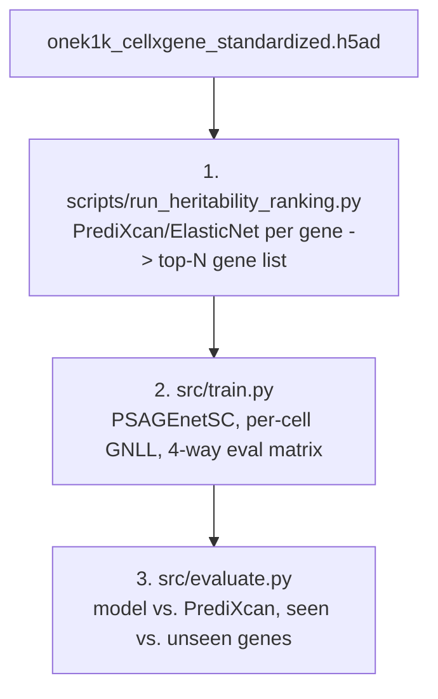
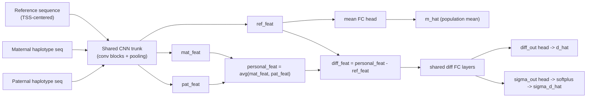

# sc-genex: a from-scratch, pSAGE-net-inspired single-cell sequence-to-expression model

A from-scratch (no pretrained weights), compact CNN that predicts single-cell gene expression from
personal genotype, trained and evaluated on [OneK1K](https://onek1k.org/) single-cell data for a
specifiable cell type. Directly inspired by
[pSAGE-net](https://github.com/mostafavilabuw/SAGEnet)
([Nature Methods 2026](https://www.nature.com/articles/s41592-026-03124-8)), with three changes:

1. **No pseudobulking at training time.** Every single cell is its own training example (the
   donor's DNA input is identical across their cells, but each cell's own expression value is
   scored separately) -- pSAGE-net itself trains on bulk RNA-seq (one value per individual).
2. **A third prediction head**: in addition to pSAGE-net's *mean* (population mean expression) and
   *difference* (personal deviation from the mean) heads, a new **difference-sigma** head predicts
   the donor's cell-to-cell std of that difference -- i.e. how variable this gene's expression is
   across that donor's own cells.
3. **Gaussian NLL instead of MSE on the difference head**, using the new sigma head to model the
   full per-cell distribution rather than just its mean -- the natural loss once training is
   per-cell rather than per-individual.

Training/eval genes are the top-N (heritability estimate via PrediXcan/elastic net), and the model
is evaluated across all 4 combinations of seen/unseen individual x seen/unseen gene, with a final
comparison against PrediXcan itself (Pearson r).

## Pipeline overview



1. **`scripts/run_heritability_ranking.py`**: for every protein-coding autosomal gene present in
   the h5ad, fits an ElasticNet model (dosage -> pseudobulk expression, PrediXcan-style) on train
   donors and ranks by held-out (val-donor) Pearson r. Writes the full ranking (resumable) and a
   `top_N_genes.csv`.
2. **`src/train.py`**: trains `PSAGEnetSC` on the top-N genes x train donors (per-cell targets, no
   pseudobulking), with early stopping on a held-out donor slice, then reports the full 4-way
   seen/unseen-gene x seen/unseen-individual evaluation matrix.
3. **`src/evaluate.py`**: refits PrediXcan on train+val donors for every *seen* (trained-on) gene
   and compares its held-out test-donor Pearson r directly against the trained model's.

## What's implemented

| File | Responsibility |
|---|---|
| `src/genome.py` | GTF parser (gene TSS + biotype), reference FASTA reader, per-chromosome VCF reader (dosage *and* phased-genotype access), and both personalized-sequence builders: `build_personalized_onehot` (dosage-averaged, used by the PrediXcan baseline) and `build_haplotype_onehots` (phased maternal/paternal, used by the model). |
| `src/splits.py` | `split_donors` (random, seeded) and `split_genes_by_chromosome` (whole chromosomes assigned greedily to train/val/test, so nearby loci never straddle a split). |
| `src/regression_utils.py` | `ElasticNetBaseline` (the PrediXcan-equivalent regression engine), dosage imputation/MAF filtering, permutation testing. |
| `src/heritability.py` + `scripts/run_heritability_ranking.py` | Multi-gene PrediXcan/ElasticNet ranking, parallelized across genes, resumable via an incrementally-saved CSV. |
| `data/preprocess.py` | Loads the OneK1K h5ad (backed mode) for one cell type: `load_celltype_pseudobulk_matrix` (many genes -> per-donor pseudobulk means, used by heritability ranking) and `load_celltype_multigene_cells`/`build_multigene_donor_table` (per-cell values for the smaller final training gene set, plus population means computed from train donors only). |
| `src/model.py` | `PSAGEnetSC`: shared CNN trunk (`CNNTrunk`, ported from pSAGE-net's conv stack) + 3 FC heads (mean, diff, diff-sigma). |
| `src/loss.py` | `psagenet_sc_loss`: MSE on the mean head + per-cell-weighted Gaussian NLL on the diff/diff-sigma heads. |
| `src/dataset.py` | `PersonalGenomeDatasetSC` (training: one item per (gene, donor) with per-cell targets) and `PersonalGenomeEvalDataset` (evaluation: one item per (gene, donor) from an arbitrary gene x donor combination, with pseudobulk targets). |
| `src/metrics.py` | `grouped_correlation`: per-gene and per-donor Pearson r, the primary reporting metric for the 4-way matrix. |
| `src/wandb_logger.py` | Optional W&B logging; no-op by default. |
| `src/train.py` | Training CLI: builds the pipeline, trains, early-stops, reports the 4-way matrix. |
| `src/evaluate.py` | Final model-vs-PrediXcan comparison CLI. |

## Architecture



`CNNTrunk` (ported from pSAGE-net's `rSAGEnet`/`pSAGEnet` conv stack) is applied with **shared
weights** to the reference sequence and to each haplotype of the personal sequence. A shared
projection layer (`feature_proj`, pSAGE-net's `fc0`) is then applied -- again with shared weights --
to the reference features and to the haplotype-averaged personal features, before the three heads
branch off. Default hyperparameters are the paper's bolded choices: `first_layer_kernel_number=900`,
`int_layers_kernel_number=256`, `n_conv_blocks=5`, `pooling_size=10`, `hidden_size=256`,
`h_layers=1` -- yielding a model with ~2.7M parameters (vs. Enformer's ~350M in the prior POC), so
it trains from scratch on a single GPU (or even CPU, for small runs).

## Loss (`src/loss.py`)

For a batch of `(gene, donor)` pairs, each with a variable number of per-cell targets:

```
d_ij = y_ij - m_g          # cell j of donor i, gene g; m_g = population mean over TRAIN donors only
mean_loss = MSE(m_hat_gi, m_g)
diff_loss = per_cell_gaussian_nll(d_hat_gi, sigma_d_hat_gi, {d_ij}_j)   # weighted by cell count
loss = lam_ref * mean_loss + lam_diff * diff_loss                      # lam_ref=1, lam_diff=10 (paper defaults)
```

`per_cell_gaussian_nll` sums the per-cell NLL across the whole batch and divides by the batch's
*total cell count* (not the number of examples) -- mathematically identical to training on every
individual cell independently with a shared per-example input, and means the MLE recovered by
training is each `(gene, donor)`'s own per-cell sample mean and (biased) sample std.

## Data requirements

Only `data/onek1k_cellxgene_standardized.h5ad` exists in this repo. To run anything else you must
supply, as CLI arguments:

- `--vcf-dir`: a directory with one **bgzip + tabix-indexed, phased** VCF per chromosome (biallelic
  SNPs, standard `GT` field with `|`-separated phased genotypes, e.g. `0|1`), e.g. `chr1.vcf.gz` ..
  `chr22.vcf.gz` or `1.vcf.gz` .. `22.vcf.gz` (configurable via `--vcf-filename-template`). **No
  phasing is performed by this pipeline** -- VCFs are assumed already phased (e.g. from imputation
  upstream). Heterozygous sites that aren't marked `phased` are skipped by default (both haplotypes
  keep the reference base) rather than guessing; pass `--strict-phasing` to raise instead.

  **Sample naming is *not* the identity mapping.** The h5ad's `obs['donor_id']` is formatted
  `"{X}_{Y}"` (e.g. `"10_10"`), but the real OneK1K genotype files use individual IDs formatted
  `"OneK1K_{Y}"` -- confirmed against an actual `.fam` file:

  ```
  0   OneK1K_1     0   0   2   -9
  0   OneK1K_10    0   0   2   -9
  0   OneK1K_100   0   0   0   -9
  ```

  i.e. only the second (`Y`) component of `donor_id` is used, prefixed with `OneK1K_`. This is the
  **default** (`--vcf-sample-id-scheme onek1k`, `--vcf-sample-id-prefix "OneK1K_"`). Pass
  `--vcf-sample-id-scheme identity` if your genotype files instead use the donor_id string directly,
  or `--donor-id-map path/to/mapping.csv` (2-column CSV: `h5ad_donor_id,vcf_sample_id`) for any
  donors that don't follow the default convention.
- `--genome-fasta`: an indexed reference genome FASTA matching the VCFs' build (e.g. hg38,
  `samtools faidx`/`pysam.faidx` run once beforehand). Not needed for
  `scripts/run_heritability_ranking.py` (PrediXcan/ElasticNet only needs dosage, not sequence).
- `--gtf`: a GTF/GFF gene annotation (GENCODE/Ensembl-style, `gene_type`/`gene_biotype` +
  `gene_id` attributes) whose `gene_id` matches the h5ad's `var` index (Ensembl IDs).

None of these three are auto-downloaded -- this is a deliberate choice to keep the pipeline free of
network calls at run time.

## Usage

```bash
uv sync  # installs torch, anndata, pysam, scikit-learn, etc. -- see pyproject.toml
```

### 1. Rank genes by heritability, select the top-N

```bash
uv run python scripts/run_heritability_ranking.py \
  --h5ad-path data/onek1k_cellxgene_standardized.h5ad \
  --cell-type "naive B cell" \
  --vcf-dir /path/to/genotypes --gtf /path/to/gencode.gtf.gz \
  --out-dir results/heritability/naive_B_cell \
  --top-n 1000 --n-workers 8
```

`--cell-type` must exactly match a value in `obs['cell_type']` (see the 29 OneK1K categories, e.g.
`naive B cell`, `CD4-positive, alpha-beta T cell`, `CD14-positive monocyte`, ...). This step can be
slow the first time (potentially ~15-20k protein-coding autosomal candidate genes) -- progress is
saved incrementally to `--out-dir/heritability_ranking.csv`, so an interrupted run resumes where it
left off. Writes `--out-dir/top_1000_genes.csv` (columns: `gene_id, chrom, n_variants,
val_pearson_r, alpha, l1_ratio`), the input to step 2.

### 2. Train `PSAGEnetSC`

```bash
uv run python src/train.py \
  --h5ad-path data/onek1k_cellxgene_standardized.h5ad \
  --cell-type "naive B cell" \
  --top-genes-csv results/heritability/naive_B_cell/top_1000_genes.csv \
  --vcf-dir /path/to/genotypes --genome-fasta /path/to/hg38.fa --gtf /path/to/gencode.gtf.gz \
  --out-dir results/naive_B_cell_psagenet_sc
```

`--seed`/`--donor-val-frac`/`--donor-test-frac` must match the values used in step 1 so the donor
splits agree (defaults do). Writes to `--out-dir`:
- `donor_split.csv`, `gene_split.csv`, `model_config.json` -- everything `src/evaluate.py` needs to
  reload this exact run.
- `predictions_{seen,unseen}_gene_{seen,unseen}_donor.csv` (one row per `(gene, donor)` pair,
  pseudobulk truth vs. prediction) and `final_eval_matrix_summary.csv` for the full 4-way matrix.
- `best_model.pt` (the checkpoint with the best early-stopping metric; pass `--no-save-checkpoint`
  to skip this if you only need the prediction CSVs).

Model architecture flags (`--hidden-size`, `--n-conv-blocks`, etc.) default to the paper's
hyperparameters; `--max-eval-pairs` caps each eval-matrix cell's (gene, donor) pairs via random
subsampling to keep per-run eval cost bounded (the `seen_gene x seen_donor` cell especially, whose
full cross product can be very large) -- raise it (or pass a very large value) for a more
statistically complete final report once you're past initial pipeline sanity-checking.

### 3. Compare against PrediXcan

```bash
uv run python src/evaluate.py \
  --results-dir results/naive_B_cell_psagenet_sc \
  --h5ad-path data/onek1k_cellxgene_standardized.h5ad --cell-type "naive B cell" \
  --vcf-dir /path/to/genotypes --genome-fasta /path/to/hg38.fa --gtf /path/to/gencode.gtf.gz
```

Refits ElasticNet on train+val donors for every gene the model actually trained on ("seen"),
evaluates both the refit PrediXcan model and the trained `PSAGEnetSC` on the same held-out test
donors, and writes `--results-dir/model_vs_predixcan.csv` (`gene_id, gene_split, model_pearson_r,
predixcan_pearson_r, ...`). "Unseen" (test-split) genes have no PrediXcan counterpart here --
PrediXcan doesn't have a "genes it was/wasn't trained on" concept the way the sequence model does --
so `predixcan_pearson_r` is left blank for them; the model's own per-gene Pearson r is still
reported.

## Testing performed

Real phased VCFs / a real reference genome FASTA / GPU were not available in the development
environment, so full biologically-meaningful training was not run. Instead, correctness was
verified with:

- A forward-pass smoke test of `PSAGEnetSC` (both a tiny config and the paper's full default
  hyperparameters) confirming output shapes, `sigma > 0`, and correct parameter counts.
- A full, real end-to-end run of all three CLIs chained together
  (`scripts/run_heritability_ranking.py` -> `src/train.py` -> `src/evaluate.py`) against the
  **real** OneK1K h5ad (a small cell type, ~4,500 cells / ~875 donors) combined with a
  **synthetic** phased genome (random reference sequence + random phased genotypes for 30 real
  gene IDs across 6 fake chromosomes, since a real hg38 FASTA and real phased VCFs weren't
  available): confirmed the donor/gene splits, pseudobulk matrix construction, parallelized
  ElasticNet ranking (including correct handling of genes with zero cross-donor expression
  variance), per-cell training loop and loss, the full 4-way eval-matrix computation and CSV
  output, checkpointing, and the final PrediXcan refit/comparison all run to completion and
  produce sane output shapes/values end to end.
- This surfaced and fixed a real bug in the elastic-net baseline: `sklearn`'s `ElasticNetCV`
  has a known float32-precision issue in its internal Gram-matrix precompute path (a Gram entry
  recomputed in float64 fails strict equality against the float32-computed original); fixed by
  casting to float64 throughout `ElasticNetBaseline`.

## Out of scope for this project

- Auto-downloading the reference genome, GTF, or genotype data, or performing genotype phasing.
- Indel support in haplotype construction (SNPs only, like the dosage-based baseline).
- Distributed training / multi-GPU support.
- pSAGE-net's contrastive pairwise loss term (not part of the plan for this project).
