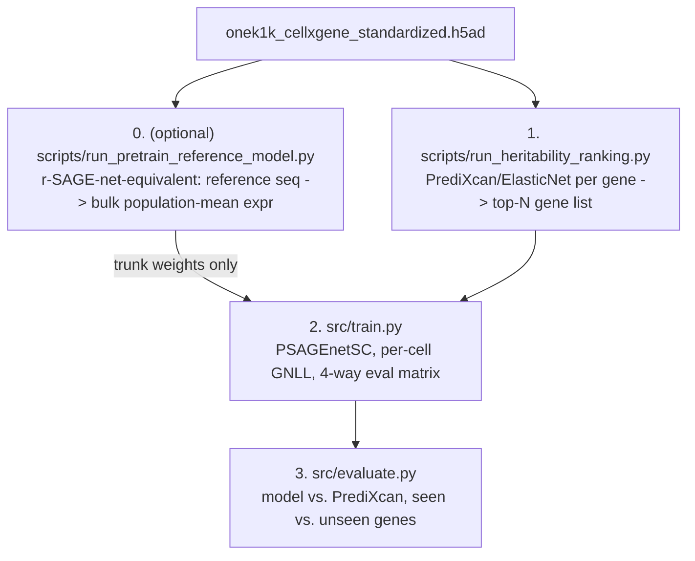
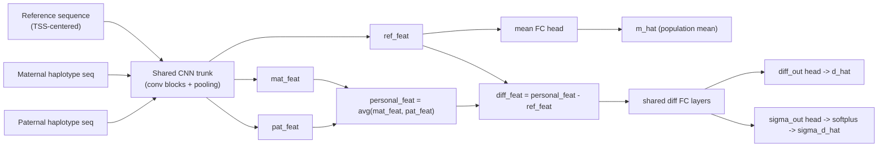

# sc-genex: a from-scratch, pSAGE-net-inspired single-cell sequence-to-expression model

A from-scratch (no pretrained weights), compact CNN that predicts single-cell gene expression from
personal genotype, trained and evaluated on [OneK1K](https://onek1k.org/) single-cell data for a
specifiable cell type. Directly inspired by
[pSAGE-net](https://github.com/mostafavilabuw/SAGEnet)
([Nature Methods 2026](https://www.nature.com/articles/s41592-026-03124-8)), with three changes:

1. **No pseudobulking at training time.** Every single cell is its own training example (the
   donor's DNA input is identical across their cells, but each cell's own expression value is
   scored separately) -- pSAGE-net itself trains on bulk RNA-seq (one value per individual).
2. **A third prediction head**: in addition to pSAGE-net's *mean* (population mean expression) and
   *difference* (personal deviation from the mean) heads, a new **difference-sigma** head predicts
   the donor's cell-to-cell std of that difference -- i.e. how variable this gene's expression is
   across that donor's own cells.
3. **Gaussian NLL instead of MSE on the difference head**, using the new sigma head to model the
   full per-cell distribution rather than just its mean -- the natural loss once training is
   per-cell rather than per-individual.

Training/eval genes are the top-N (heritability estimate via PrediXcan/elastic net), and the model
is evaluated across all 4 combinations of seen/unseen individual x seen/unseen gene, with a final
comparison against PrediXcan itself (Pearson r).

No pretrained weights from the original pSAGE-net paper are used anywhere (the paper doesn't release
any, likely due to ROSMAP/GTEx data-access restrictions) -- but this repo does include an *optional*,
from-scratch reimplementation of the paper's own two-stage recipe: a reference-sequence-only
"r-SAGE-net" pretraining stage (`scripts/run_pretrain_reference_model.py`) that can warm-start
`PSAGEnetSC`'s shared convolutional trunk (`--init-from-reference-model`) before personal-genome
fine-tuning, see [step 0](#0-optional-pretrain-a-reference-only-trunk-r-sage-net-equivalent) below.

## Pipeline overview



0. **(optional) `scripts/run_pretrain_reference_model.py`**: trains `ReferenceExpressionModel` (an
   r-SAGE-net equivalent) to predict each gene's population-mean **bulk** expression (pooled across
   *all* cell types per donor, not one cell type -- see
   [Pretraining target: bulk](#pretraining-target-bulk) below) from reference sequence alone, across
   the full protein-coding autosomal gene universe. Its `reference_model.pt` can then warm-start
   `PSAGEnetSC`'s shared trunk in step 2 via `--init-from-reference-model`.
1. **`scripts/run_heritability_ranking.py`**: for every protein-coding autosomal gene present in
   the h5ad, fits an ElasticNet model (dosage -> pseudobulk expression, PrediXcan-style) on train
   donors and ranks by held-out (val-donor) Pearson r. Writes the full ranking (resumable) and a
   `top_N_genes.csv`.
2. **`src/train.py`**: trains `PSAGEnetSC` on the top-N genes x train donors (per-cell targets, no
   pseudobulking), with early stopping on a held-out donor slice, then reports the full 4-way
   seen/unseen-gene x seen/unseen-individual evaluation matrix. Optionally warm-started from step 0's
   trunk weights (`--init-from-reference-model`).
3. **`src/evaluate.py`**: refits PrediXcan on train+val donors for every *seen* (trained-on) gene
   and compares its held-out test-donor Pearson r directly against the trained model's.

### Pretraining target: bulk

Step 0's population-mean target pools a donor's cells across **all cell types** (ignoring
`obs['cell_type']` entirely), not just the cell type being fine-tuned on in step 2 -- this is the
closest OneK1K analogue of the paper's actual bulk-tissue (ROSMAP cortex) RNA-seq pretraining data
(never any FACS-sorted subset), gives far more statistical power (all ~1.25M cells / ~981 donors
instead of e.g. ~65K cells for a single cell type) for a genome-wide gene universe of comparable
scale to the paper's 14,786 training genes, and -- crucially -- produces **one reusable pretrained
trunk checkpoint** shared across every downstream `--cell-type` fine-tuning run, rather than needing
to re-pretrain once per cell type.

Two caveats worth noting (not solved further here, but low-risk):
- The bulk pretraining donor split and a given fine-tuning run's cell-type-specific donor split
  aren't guaranteed to align perfectly (different donor universes -> `split_donors` can assign
  borderline donors differently even with the same seed). Risk is low since r-SAGE-net never sees
  personal genotype/variation at all, only reference sequence + an aggregate population statistic --
  any leakage here is far weaker than the personal-variation leakage the rest of the pipeline already
  guards against via its donor splits.
- Similarly, step 0's own gene train/val/test split is independent of any downstream top-N gene
  list's "unseen" test genes -- some fine-tuning-time "unseen" genes may have been seen (reference-
  sequence-only) during pretraining. This matches the paper's own setup.

## What's implemented

| File | Responsibility |
|---|---|
| `src/genome.py` | GTF parser (gene TSS + biotype), reference FASTA reader, per-chromosome VCF reader (dosage *and* phased-genotype access), and both personalized-sequence builders: `build_personalized_onehot` (dosage-averaged, used by the PrediXcan baseline) and `build_haplotype_onehots` (phased maternal/paternal, used by the model). |
| `src/splits.py` | `split_donors` (random, seeded) and `split_genes_by_chromosome` (whole chromosomes assigned greedily to train/val/test, so nearby loci never straddle a split). |
| `src/regression_utils.py` | `ElasticNetBaseline` (the PrediXcan-equivalent regression engine), dosage imputation/MAF filtering, permutation testing. |
| `src/heritability.py` + `scripts/run_heritability_ranking.py` | Multi-gene PrediXcan/ElasticNet ranking, parallelized across genes, resumable via an incrementally-saved CSV. |
| `data/preprocess.py` | Loads the OneK1K h5ad (backed mode): `load_celltype_pseudobulk_matrix` (many genes -> per-donor pseudobulk means for one cell type, or **bulk** across all cell types via `cell_type=None`/`load_bulk_pseudobulk_matrix`, used by heritability ranking and reference-only pretraining respectively) and `load_celltype_multigene_cells`/`build_multigene_donor_table` (per-cell values for the smaller final training gene set, plus population means computed from train donors only). |
| `src/model.py` | `PSAGEnetSC`: shared CNN trunk (`CNNTrunk`, ported from pSAGE-net's conv stack) + 3 FC heads (mean, diff, diff-sigma). `ReferenceExpressionModel`: the r-SAGE-net-equivalent reference-only pretraining model, reusing `CNNTrunk` (same `trunk` submodule name) + its own `feature_proj`/`fc`/`out`. `TRUNK_HYPERPARAM_KEYS` + `validate_trunk_hyperparams`/`load_trunk_from_reference_model`: the shared-hyperparameter contract and loader used by `--init-from-reference-model`. |
| `src/loss.py` | `psagenet_sc_loss`: MSE on the mean head + per-cell-weighted Gaussian NLL on the diff/diff-sigma heads. |
| `src/dataset.py` | `PersonalGenomeDatasetSC` (training: one item per (gene, donor) with per-cell targets) and `PersonalGenomeEvalDataset` (evaluation: one item per (gene, donor) from an arbitrary gene x donor combination, with pseudobulk targets). |
| `src/pretrain.py` + `scripts/run_pretrain_reference_model.py` | r-SAGE-net-equivalent reference-only pretraining: `ReferenceExpressionDataset` (one item per *gene*, no donor dimension, reference sequence + bulk population-mean target) and a plain-MSE train/eval loop with early stopping + incremental checkpointing, mirroring `src/train.py`'s structure. |
| `src/metrics.py` | `grouped_correlation`: per-gene and per-donor Pearson r, the primary reporting metric for the 4-way matrix. |
| `src/wandb_logger.py` | Optional W&B logging; no-op by default. |
| `src/train.py` | Training CLI: builds the pipeline, optionally warm-starts the trunk from a pretraining run (`--init-from-reference-model`), trains, early-stops, reports the 4-way matrix. |
| `src/evaluate.py` | Final model-vs-PrediXcan comparison CLI. |

## Architecture



`CNNTrunk` (ported from pSAGE-net's `rSAGEnet`/`pSAGEnet` conv stack) is applied with **shared
weights** to the reference sequence and to each haplotype of the personal sequence. A shared
projection layer (`feature_proj`, pSAGE-net's `fc0`) is then applied -- again with shared weights --
to the reference features and to the haplotype-averaged personal features, before the three heads
branch off. Default hyperparameters are the paper's bolded choices: `first_layer_kernel_number=900`,
`int_layers_kernel_number=256`, `n_conv_blocks=5`, `pooling_size=10`, `hidden_size=256`,
`h_layers=1` -- yielding a model with ~2.7M parameters (vs. Enformer's ~350M in the prior POC), so
it trains from scratch on a single GPU (or even CPU, for small runs).

`ReferenceExpressionModel` (`src/model.py`, used by the optional pretraining stage) reuses the exact
same `CNNTrunk` (same submodule name, `trunk`, and the same architecture-defining hyperparameters --
`TRUNK_HYPERPARAM_KEYS`) plus its own `feature_proj`/`fc`/single output head, applied to reference
sequence only -- no maternal/paternal branches, no diff heads, since there's no personal genome
input at this stage at all. `--init-from-reference-model` (`src/train.py`) copies only this shared
`trunk`'s weights into a fresh `PSAGEnetSC`; `feature_proj`/`mean_fc`/`mean_out`/`diff_fc`/`diff_out`/
`diff_sigma_out` are always randomly initialized, matching the paper's own r-SAGE-net -> p-SAGE-net
transfer exactly ("all parameters in the convolutional and pooling layers of r-SAGE-net are loaded
into p-SAGE-net").

## Loss (`src/loss.py`)

For a batch of `(gene, donor)` pairs, each with a variable number of per-cell targets:

```
d_ij = y_ij - m_g          # cell j of donor i, gene g; m_g = population mean over TRAIN donors only
mean_loss = MSE(m_hat_gi, m_g)
diff_loss = per_cell_gaussian_nll(d_hat_gi, sigma_d_hat_gi, {d_ij}_j)   # weighted by cell count
loss = lam_ref * mean_loss + lam_diff * diff_loss                      # lam_ref=1, lam_diff=10 (paper defaults)
```

`per_cell_gaussian_nll` sums the per-cell NLL across the whole batch and divides by the batch's
*total cell count* (not the number of examples) -- mathematically identical to training on every
individual cell independently with a shared per-example input, and means the MLE recovered by
training is each `(gene, donor)`'s own per-cell sample mean and (biased) sample std.

## Data requirements

Only `data/onek1k_cellxgene_standardized.h5ad` exists in this repo. To run anything else you must
supply, as CLI arguments:

- `--vcf-dir`: a directory with one **bgzip + tabix-indexed, phased** VCF per chromosome (biallelic
  SNPs, standard `GT` field with `|`-separated phased genotypes, e.g. `0|1`), e.g. `chr1.vcf.gz` ..
  `chr22.vcf.gz` or `1.vcf.gz` .. `22.vcf.gz` (configurable via `--vcf-filename-template`). **No
  phasing is performed by this pipeline** -- VCFs are assumed already phased (e.g. from imputation
  upstream). Heterozygous sites that aren't marked `phased` are skipped by default (both haplotypes
  keep the reference base) rather than guessing; pass `--strict-phasing` to raise instead.

  **Sample naming is *not* the identity mapping.** The h5ad's `obs['donor_id']` is formatted
  `"{X}_{Y}"` (e.g. `"10_10"`), but the real OneK1K genotype files use individual IDs formatted
  `"OneK1K_{Y}"` -- confirmed against an actual `.fam` file:

  ```
  0   OneK1K_1     0   0   2   -9
  0   OneK1K_10    0   0   2   -9
  0   OneK1K_100   0   0   0   -9
  ```

  i.e. only the second (`Y`) component of `donor_id` is used, prefixed with `OneK1K_`. This is the
  **default** (`--vcf-sample-id-scheme onek1k`, `--vcf-sample-id-prefix "OneK1K_"`). Pass
  `--vcf-sample-id-scheme identity` if your genotype files instead use the donor_id string directly,
  or `--donor-id-map path/to/mapping.csv` (2-column CSV: `h5ad_donor_id,vcf_sample_id`) for any
  donors that don't follow the default convention.
- `--genome-fasta`: an indexed reference genome FASTA matching the VCFs' build (e.g. hg38,
  `samtools faidx`/`pysam.faidx` run once beforehand). Not needed for
  `scripts/run_heritability_ranking.py` (PrediXcan/ElasticNet only needs dosage, not sequence).
- `--gtf`: a GTF/GFF gene annotation (GENCODE/Ensembl-style, `gene_type`/`gene_biotype` +
  `gene_id` attributes) whose `gene_id` matches the h5ad's `var` index (Ensembl IDs).

None of these three are auto-downloaded -- this is a deliberate choice to keep the pipeline free of
network calls at run time.

`scripts/run_pretrain_reference_model.py` (step 0) is the exception: it needs `--genome-fasta` and
`--gtf` but **no VCF at all** -- r-SAGE-net-style pretraining never touches personal genotype, only
reference sequence.

## Usage

```bash
uv sync  # installs torch, anndata, pysam, scikit-learn, etc. -- see pyproject.toml
```

### 0. (optional) Pretrain a reference-only trunk (r-SAGE-net equivalent)

```bash
uv run python scripts/run_pretrain_reference_model.py \
  --h5ad-path data/onek1k_cellxgene_standardized.h5ad \
  --genome-fasta /path/to/hg38.fa --gtf /path/to/gencode.gtf.gz \
  --out-dir results/reference_pretrain
```

Trains `ReferenceExpressionModel` on the full protein-coding autosomal gene universe present in the
h5ad (typically ~15-20k genes, comparable in scale to the paper's 14,786), predicting each gene's
**bulk** population-mean expression (pooled across all cell types and train donors -- see
[Pretraining target: bulk](#pretraining-target-bulk)) from reference sequence alone. This is a
one-time step: the resulting `--out-dir` is reusable across every downstream `--cell-type`
fine-tuning run in step 2, since pretraining never depends on a specific cell type or top-N gene
list. Writes `reference_model.pt`, `reference_model_config.json` (trunk hyperparameters, checked by
`--init-from-reference-model`), `donor_split.csv`/`gene_split.csv`, and a final held-out-gene
Pearson r report (`final_test_summary.csv`). Model hyperparameter flags share the same names as
`src/train.py`'s (`--first-layer-kernel-number`, `--n-conv-blocks`, etc.) so a fine-tuning run can
reuse identical values.

### 1. Rank genes by heritability, select the top-N

```bash
uv run python scripts/run_heritability_ranking.py \
  --h5ad-path data/onek1k_cellxgene_standardized.h5ad \
  --cell-type "naive B cell" \
  --vcf-dir /path/to/genotypes --gtf /path/to/gencode.gtf.gz \
  --out-dir results/heritability/naive_B_cell \
  --top-n 1000 --n-workers 8
```

`--cell-type` must exactly match a value in `obs['cell_type']` (see the 29 OneK1K categories, e.g.
`naive B cell`, `CD4-positive, alpha-beta T cell`, `CD14-positive monocyte`, ...). This step can be
slow the first time (potentially ~15-20k protein-coding autosomal candidate genes) -- progress is
saved incrementally to `--out-dir/heritability_ranking.csv`, so an interrupted run resumes where it
left off. Writes `--out-dir/top_1000_genes.csv` (columns: `gene_id, chrom, n_variants,
val_pearson_r, alpha, l1_ratio`), the input to step 2.

### 2. Train `PSAGEnetSC`

```bash
uv run python src/train.py \
  --h5ad-path data/onek1k_cellxgene_standardized.h5ad \
  --cell-type "naive B cell" \
  --top-genes-csv results/heritability/naive_B_cell/top_1000_genes.csv \
  --vcf-dir /path/to/genotypes --genome-fasta /path/to/hg38.fa --gtf /path/to/gencode.gtf.gz \
  --init-from-reference-model results/reference_pretrain \
  --out-dir results/naive_B_cell_psagenet_sc
```

`--init-from-reference-model` (optional, from step 0) warm-starts `PSAGEnetSC`'s shared trunk from a
pretrained `reference_model.pt`; omit it to train the trunk from scratch, as before. If passed, every
`TRUNK_HYPERPARAM_KEYS` flag (`--first-layer-kernel-number`, `--pooling-size`, `--seq-len` /
`input_length`, etc.) must exactly match the values used for that pretraining run, or `src/train.py`
raises a clear error listing the mismatches before touching any weights (`--hidden-size`/`--h-layers`/
`--dropout`/`--subtract-or-concat` only affect the never-transferred post-trunk heads, so they're
free to differ).

`--seed`/`--donor-val-frac`/`--donor-test-frac` must match the values used in step 1 so the donor
splits agree (defaults do). Writes to `--out-dir`:
- `donor_split.csv`, `gene_split.csv`, `model_config.json` -- everything `src/evaluate.py` needs to
  reload this exact run.
- `predictions_{seen,unseen}_gene_{seen,unseen}_donor.csv` (one row per `(gene, donor)` pair,
  pseudobulk truth vs. prediction) and `final_eval_matrix_summary.csv` for the full 4-way matrix.
- `best_model.pt` (the checkpoint with the best early-stopping metric; pass `--no-save-checkpoint`
  to skip this if you only need the prediction CSVs).

Model architecture flags (`--hidden-size`, `--n-conv-blocks`, etc.) default to the paper's
hyperparameters; `--max-eval-pairs` caps each eval-matrix cell's (gene, donor) pairs via random
subsampling to keep per-run eval cost bounded (the `seen_gene x seen_donor` cell especially, whose
full cross product can be very large) -- raise it (or pass a very large value) for a more
statistically complete final report once you're past initial pipeline sanity-checking.

### 3. Compare against PrediXcan

```bash
uv run python src/evaluate.py \
  --results-dir results/naive_B_cell_psagenet_sc \
  --h5ad-path data/onek1k_cellxgene_standardized.h5ad --cell-type "naive B cell" \
  --vcf-dir /path/to/genotypes --genome-fasta /path/to/hg38.fa --gtf /path/to/gencode.gtf.gz
```

Refits ElasticNet on train+val donors for every gene the model actually trained on ("seen"),
evaluates both the refit PrediXcan model and the trained `PSAGEnetSC` on the same held-out test
donors, and writes `--results-dir/model_vs_predixcan.csv` (`gene_id, gene_split, model_pearson_r,
predixcan_pearson_r, ...`). "Unseen" (test-split) genes have no PrediXcan counterpart here --
PrediXcan doesn't have a "genes it was/wasn't trained on" concept the way the sequence model does --
so `predixcan_pearson_r` is left blank for them; the model's own per-gene Pearson r is still
reported.

## Testing performed

Real phased VCFs / a real reference genome FASTA / GPU were not available in the development
environment, so full biologically-meaningful training was not run. Instead, correctness was
verified with:

- A forward-pass smoke test of `PSAGEnetSC` (both a tiny config and the paper's full default
  hyperparameters) confirming output shapes, `sigma > 0`, and correct parameter counts.
- A full, real end-to-end run of all three CLIs chained together
  (`scripts/run_heritability_ranking.py` -> `src/train.py` -> `src/evaluate.py`) against the
  **real** OneK1K h5ad (a small cell type, ~4,500 cells / ~875 donors) combined with a
  **synthetic** phased genome (random reference sequence + random phased genotypes for 30 real
  gene IDs across 6 fake chromosomes, since a real hg38 FASTA and real phased VCFs weren't
  available): confirmed the donor/gene splits, pseudobulk matrix construction, parallelized
  ElasticNet ranking (including correct handling of genes with zero cross-donor expression
  variance), per-cell training loop and loss, the full 4-way eval-matrix computation and CSV
  output, checkpointing, and the final PrediXcan refit/comparison all run to completion and
  produce sane output shapes/values end to end.
- This surfaced and fixed a real bug in the elastic-net baseline: `sklearn`'s `ElasticNetCV`
  has a known float32-precision issue in its internal Gram-matrix precompute path (a Gram entry
  recomputed in float64 fails strict equality against the float32-computed original); fixed by
  casting to float64 throughout `ElasticNetBaseline`.
- A full, real end-to-end run of the pretraining stage (`scripts/run_pretrain_reference_model.py`)
  against a small real-h5ad subset (12 donors, 24 real gene IDs, 6,000 cells across ~25 cell types)
  combined with a synthetic reference genome/GTF: confirmed the bulk pseudobulk loader
  (`cell_type=None`), gene-universe construction, donor/gene splits, population-mean targets, the
  eager reference-sequence-caching dataset, and the plain-MSE train/eval/checkpointing loop all run
  to completion. Then chained its `reference_model.pt` into `src/train.py --init-from-reference-model`
  (with matching synthetic phased VCFs) and confirmed: (1) the trunk hyperparameter validation
  passes and the trunk loads correctly when configs match, producing a working warm-started
  `PSAGEnetSC` that trains and evaluates normally, and (2) an injected hyperparameter mismatch
  (`--first-layer-kernel-number`) is caught before any weights are touched, raising a clear,
  actionable error naming the mismatched field and both values.

## Out of scope for this project

- Auto-downloading the reference genome, GTF, or genotype data, or performing genotype phasing.
- Indel support in haplotype construction (SNPs only, like the dosage-based baseline).
- Distributed training / multi-GPU support.
- pSAGE-net's contrastive pairwise loss term (not part of the plan for this project).
